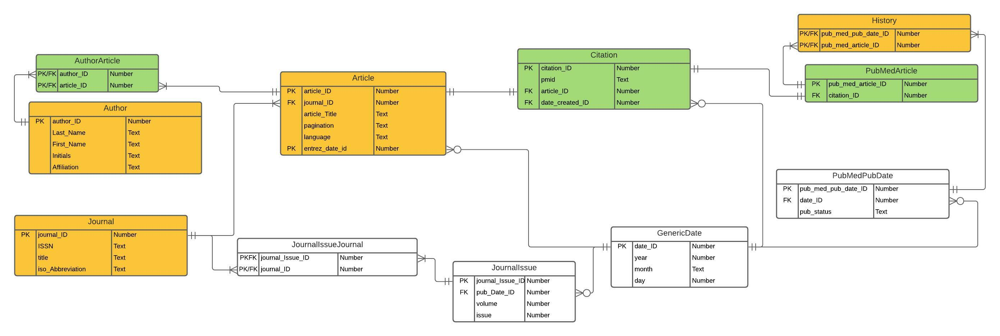
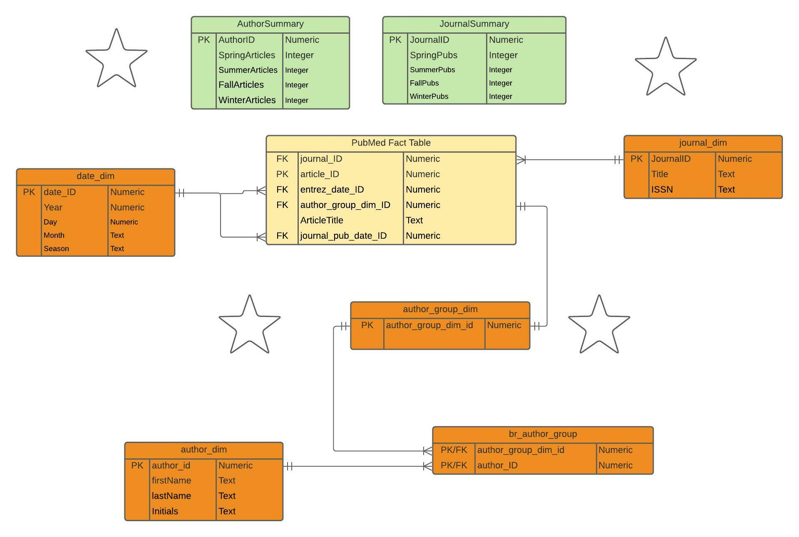

```{r}
# Library
library(RMySQL)
library(XML)

library(DBI)
library(knitr)

# Settings
db_user <- 'cs5200'
db_password <- '6Ml4%8MMxrWq%3r'
db_name <- 'Practicum2DB'
db_host <- 'cs5200-db-p2.czafxup9tot6.us-east-2.rds.amazonaws.com' # AWS Host
db_port <- 3306

# Read data from db
mydb <- dbConnect(MySQL(), user = db_user, password = db_password,
                  dbname = db_name, host = db_host, port = db_port)
```

```{r}
path <- "C:/Users/galen/OneDrive/5200DBMS/Practicum2/"
fn <- "pubmed_sample.xml"
fpn = paste0(path, fn)

# Reading the XML file and parse into DOM
xmlDOM <- xmlParse(file = fpn)
root <- xmlRoot(xmlDOM)

```

Part 1




```{sql connection=mydb}
DROP TABLE IF EXISTS JournalIssueJournal
```

```{sql connection=mydb}
DROP TABLE IF EXISTS History
```

```{sql connection=mydb}
DROP TABLE IF EXISTS PubMedPubDate
```

```{sql connection=mydb}
DROP TABLE IF EXISTS PubMedArticle
```

```{sql connection=mydb}
DROP TABLE IF EXISTS Citation
```

```{sql connection=mydb}
DROP TABLE IF EXISTS AuthorArticle
```

```{sql connection=mydb}
DROP TABLE IF EXISTS Author
```

```{sql connection=mydb}
DROP TABLE IF EXISTS Article
```

```{sql connection=mydb}
DROP TABLE IF EXISTS Journal
```

```{sql connection=mydb}
DROP TABLE IF EXISTS JournalIssue
```

```{sql connection=mydb}
DROP TABLE IF EXISTS GenericDate
```

```{r}
dbListTables(mydb)

```

```{sql connection=mydb}
CREATE TABLE GenericDate(
  date_ID INTEGER NOT NULL PRIMARY KEY,
  year INTEGER NOT NULL,
  month TEXT NOT NULL,
  day INTEGER NOT NULL
);

```

```{sql connection=mydb}
CREATE TABLE JournalIssue(
  journal_Issue_ID INTEGER NOT NULL PRIMARY KEY,
  pub_Date_ID INTEGER NOT NULL,
  volume INTEGER NOT NULL,
  issue INTEGER NOT NULL,
  CONSTRAINT journalIssue_fk_date FOREIGN KEY
            (pub_Date_ID) REFERENCES GenericDate (date_ID)
);

```

```{sql connection=mydb}
CREATE TABLE Journal(
  journal_ID INTEGER NOT NULL PRIMARY KEY,
  ISSN TEXT NOT NULL,
  title TEXT NOT NULL,
  iso_Abbreviation TEXT NOT NULL
);

```

```{sql connection=mydb}
CREATE TABLE Article(
  article_ID INTEGER NOT NULL PRIMARY KEY,
  journal_ID INTEGER NOT NULL,
  article_Title TEXT NOT NULL,
  pagination TEXT NOT NULL,
  language TEXT NOT NULL,
  entrez_date_id INTEGER NOT NULL,
  CONSTRAINT article_fk_journal FOREIGN KEY
            (journal_ID) REFERENCES Journal (journal_ID),
  CONSTRAINT article_fk_entrez FOREIGN KEY
            (entrez_date_id) REFERENCES GenericDate (date_ID)
);

```

```{sql connection=mydb}
CREATE TABLE Author(
  author_ID INTEGER NOT NULL PRIMARY KEY,
  Last_Name TEXT NOT NULL,
  First_Name TEXT NOT NULL,
  Initials TEXT NOT NULL,
  Affiliation TEXT NOT NULL
);

```

```{sql connection=mydb}
CREATE TABLE AuthorArticle(
  author_ID INTEGER NOT NULL,
  article_ID INTEGER NOT NULL,
  CONSTRAINT authorArticle_pk PRIMARY KEY
            (author_ID, article_ID),
  CONSTRAINT authorArticle_fk_author FOREIGN KEY
            (author_ID) REFERENCES Author (author_ID),
  CONSTRAINT authorArticle_fk_article FOREIGN KEY
            (article_ID) REFERENCES Article (article_ID)
);

```

```{sql connection=mydb}
CREATE TABLE Citation(
  citation_ID INTEGER NOT NULL PRIMARY KEY,
  pmid TEXT NOT NULL,
  article_ID INTEGER NOT NULL,
  date_created_ID INTEGER NOT NULL,
  CONSTRAINT citation_fk_create_date FOREIGN KEY
            (date_created_ID) REFERENCES GenericDate (date_ID),
  CONSTRAINT citation_fk_article FOREIGN KEY
            (article_ID) REFERENCES Article (article_ID)
);

```

```{sql connection=mydb}
CREATE TABLE PubMedArticle(
  pub_med_article_ID INTEGER NOT NULL PRIMARY KEY,
  citation_ID INTEGER NOT NULL,
  CONSTRAINT pub_med_article_fk_citation FOREIGN KEY
            (citation_ID) REFERENCES Citation (citation_ID)
);
```

```{sql connection=mydb}
CREATE TABLE PubMedPubDate(
  pub_med_pub_date_ID INTEGER NOT NULL PRIMARY KEY,
  date_ID INTEGER NOT NULL,
  pub_status TEXT NOT NULL,
  CONSTRAINT pub_med_pub_date_fk_date FOREIGN KEY
            (date_ID) REFERENCES GenericDate (date_ID)
);

```

```{sql connection=mydb}
CREATE TABLE History(
  pub_med_pub_date_ID INTEGER NOT NULL,
  pub_med_article_ID INTEGER NOT NULL,
  CONSTRAINT history_pk PRIMARY KEY
            (pub_med_pub_date_ID, pub_med_article_ID),
  CONSTRAINT history_fk_pub_date FOREIGN KEY
            (pub_med_pub_date_ID) REFERENCES PubMedPubDate (pub_med_pub_date_ID),
  CONSTRAINT history_fk_pub_med_article FOREIGN KEY
            (pub_med_article_ID) REFERENCES PubMedArticle (pub_med_article_ID)
);

```

```{sql connection=mydb}
CREATE TABLE JournalIssueJournal(
  journal_Issue_ID INTEGER NOT NULL,
  journal_ID INTEGER NOT NULL,
  CONSTRAINT JournalIssueJournal_pk PRIMARY KEY
            (journal_Issue_ID, journal_ID),
  CONSTRAINT JournalIssueJournal_fk_journal_Issue FOREIGN KEY
            (journal_Issue_ID) REFERENCES JournalIssue (journal_Issue_ID),
  CONSTRAINT JournalIssueJournal_fk_journal FOREIGN KEY
            (journal_ID) REFERENCES Journal (journal_ID)
);

```

```{r}
dbListTables(mydb)

```


```{r createDataframes}

numPMArticles <- xmlSize(root)

GenericDate.df <- data.frame (date_ID = integer(),
                       year = integer(),
                       month = character(),
                       day = integer(),
                       stringsAsFactors = F)
                       
JournalIssue.df <- data.frame (journal_Issue_ID = integer(),
                          pub_Date_ID = integer(),
                          volume = integer(),
                          issue = integer(),
                          stringsAsFactors = F)

JournalIssueJournal.df <- data.frame (JournalIssueJournal_ID = integer(),
                          journal_Issue_ID = integer(),
                          journal_ID = integer(),
                          stringsAsFactors = F)
                       
Journal.df <- data.frame (journal_ID = integer(),
                          ISSN = character(),
                          title = character(),
                          iso_Abbreviation = character(),
                          stringsAsFactors = F)

Article.df <- data.frame (article_ID = vector (mode = "integer", length = numPMArticles),
                       journal_ID = vector (mode = "integer", length = numPMArticles),
                       article_Title = vector (mode = "character", length = numPMArticles),
                       pagination = vector (mode = "character", length = numPMArticles),
                       language = vector (mode = "character", length = numPMArticles),
                       entrez_date_id = vector (mode = "integer", length = numPMArticles),
                       stringsAsFactors = F)   
                       
Author.df <- data.frame (author_ID = integer(),
                          Last_Name = character(),
                          First_Name = character(),
                          Initials = character(),
                          Affiliation = character(),
                          stringsAsFactors = F)
                       
AuthorArticle.df <- data.frame (Author_Article_ID = integer(),
                          author_ID = integer(),
                          article_ID = integer(),
                          stringsAsFactors = F)

Citation.df <- data.frame (citation_ID = vector (mode = "integer", length = numPMArticles),
                          pmid = vector (mode = "character", length = numPMArticles),
                          article_ID = vector (mode = "integer", length = numPMArticles),
                          date_created_ID = vector (mode = "integer", length = numPMArticles),
                          stringsAsFactors = F)
                          
PubMedArticle.df <- data.frame (pub_med_article_id = vector (mode = "integer", length = numPMArticles),
                     citation_id = vector (mode = "integer", length = numPMArticles),
                     stringsAsFactors = F)
                    
PubMedPubDate.df <- data.frame (pub_med_pub_date_ID = integer(),
                          date_ID = integer(),
                          pub_status = character(),
                          stringsAsFactors = F)
                          
History.df <- data.frame (history_ID = integer(),
                          pub_med_pub_date_ID = integer(),
                          pub_med_article_ID = integer(),
                          stringsAsFactors = F)
                                                 
                       
```

```{r parseArticle}

parseArticle <- function (anArticleNode)
{
  article_Title <- xmlValue(anArticleNode[[2]])
  pagination <- xmlValue(anArticleNode[[3]])[1]
  testNode <- anArticleNode[[5]]
  language <- xmlValue(anArticleNode[[7]])
  if (xmlName(testNode) == "ELocationID")
  {
    language <- xmlValue(anArticleNode[[8]])
  }

  newArticle.df <- data.frame(article_Title, pagination, language, stringsAsFactors = F)

  return(newArticle.df)
}
```

```{r parseJournalIssue}

parseJournalIssue <- function (anIssueNode)
{
  volume <- xmlValue(anIssueNode[[1]])
  issue <- xmlValue(anIssueNode[[2]])
  
  newJournalIssue.df <- data.frame(volume, issue, stringsAsFactors = F)

  return(newJournalIssue.df)
}
```

```{r parseJournal}

parseJournal <- function(aJournalNode) {
  ISSN <- xmlValue(aJournalNode[[1]])
  title = xmlValue(aJournalNode[[3]])
  iso_Abbreviation = xmlValue(aJournalNode[[4]])

Journal.df <- data.frame(ISSN, title, iso_Abbreviation, stringsAsFactors = F)

return(Journal.df)
}

```

```{r parseCitation}

parseCitation <- function (aCitationNode)
{
  pmid <- xmlValue(aCitationNode[[1]])
  
  newCitation.df <- data.frame(pmid, stringsAsFactors = F)
  
  return(newCitation.df)
}
```

```{r parseAuthors}
parseAuthors <- function (anAuthorsNode)
{
  newAuthors.df <- data.frame(Last_Name = character(),
                          First_Name = character(),
                          Initials = character(),
                          Affiliation = character(),
                          stringsAsFactors = F)
  


  n <- xmlSize(anAuthorsNode)
  
  # extract each of the <Author> nodes under <Authors>
  for (m in 1:n)
  {
    anAuthor <- anAuthorsNode[[m]]
    Last_Name <- xmlValue(anAuthor[[1]])
    First_Name <- xmlValue(anAuthor[[2]])
    Initials <- xmlValue(anAuthor[[3]])
    if(xmlSize(anAuthor) == 4){
    Affiliation <- xmlValue(anAuthor[[4]])
    }

    newAuthors.df[m,1] <- Last_Name
    newAuthors.df[m,2] <- First_Name
    newAuthors.df[m,3] <- Initials
    if(xmlSize(anAuthor) == 4){
      newAuthors.df[m,4] <- Affiliation
    }
    else{
      newAuthors.df[m,4] <- "no affiliation listed"

    }
  }
  
  return(newAuthors.df)
}
```

```{r parseHistory}
parseHistory <- function (aHistoryNode)
{
  #temp df
  PubMedPubDatestemp.df <- data.frame(pub_status = character(), year= integer(), month = integer(), day = integer(), stringsAsFactors = F)
  PubMedPubDates.df <- data.frame(pub_status = character(), pk.GenericDate = integer(), stringsAsFactors = F)

  n <- xmlSize(aHistoryNode)
  
  for (m in 1:n)
  {
    # extract first child nodes that are always present 
    pub_status <- xmlAttrs(aHistoryNode[[m]])[1]
    aNode <- aHistoryNode[[m]]
    year <- xmlValue(aNode[[1]])
    month <- xmlValue(aNode[[2]])
    day <- xmlValue(aNode[[3]])

    PubMedPubDatestemp.df[m,4] <- pub_status
    PubMedPubDatestemp.df[m,1] <- year
    PubMedPubDatestemp.df[m,2] <- month
    PubMedPubDatestemp.df[m,3] <- day

    pk.GenericDate <- rowExistsDate(PubMedPubDatestemp.df[m,], GenericDate.df)
    
    PubMedPubDates.df[m,1] <- pub_status
    PubMedPubDates.df[m,2] <- pk.GenericDate

  }

  return(PubMedPubDates.df)
}
```

```{r parseIssueDate}
parseJournalIssueDate <- function (anIssuePubDateNode)
{

  if(xmlSize(anIssuePubDateNode) == 3){
    year <- xmlValue(anIssuePubDateNode[[1]])
    month <- xmlValue(anIssuePubDateNode[[2]])
    day <- xmlValue(anIssuePubDateNode[[3]])
  }
  if(xmlSize(anIssuePubDateNode) == 2){
    year <- xmlValue(anIssuePubDateNode[[1]])
    month <- xmlValue(anIssuePubDateNode[[2]])
    day <- 1
  }
  if(xmlSize(anIssuePubDateNode) == 1 & xmlName(anIssuePubDateNode[[1]]) == "Year"){
    year <- xmlValue(anIssuePubDateNode[[1]])
    month <- 1
    day <- 1
  }
  if(xmlSize(anIssuePubDateNode) == 1 & xmlName(anIssuePubDateNode[[1]]) == "MedlineDate"){
    #parse string for year and month
    medlineDate <- anIssuePubDateNode[[1]]
    year <- substr(xmlValue(medlineDate), 1, 4)
    month <- substr(xmlValue(medlineDate), 6, 8)
    day <- 1
  }

  IssueDate.df <- data.frame(year, month, day, stringsAsFactors = F)
  
  return(IssueDate.df)
}
```

```{r parseHistoryDate}
parseHistoryDate <- function (aHistoryNode)
{
  HistoryDates.df <- data.frame(year= integer(), month = integer(), day = integer(), stringsAsFactors = F)


  n <- xmlSize(aHistoryNode)
  for (m in 1:n)
  {
    aNode <- aHistoryNode[[m]]
    year <- xmlValue(aNode[[1]])
    month <- xmlValue(aNode[[2]])
    day <- xmlValue(aNode[[3]])
  
   HistoryDates.df[m,1] <- year
   HistoryDates.df[m,2] <- month
   HistoryDates.df[m,3] <- day
  }

  return(HistoryDates.df)
}
```

Functions to check for existing row in a given table

```{r rowExistsDate}
rowExistsDate <- function (ourRow, aDF)
{
  # check if that address is already in the data frame
   n <- nrow(aDF)
   c <- ncol(aDF)
  
  if (n == 0)
  {
    # data frame is empty, so can't exist
    return(0)
  }
  
  for (a in 1:n)
  {
    if (aDF[a,2] == ourRow[1,1] & aDF[a,3] == ourRow[1,2] & aDF[a,4] == ourRow[1,3])
    {
      # found a match; return it's ID
      return(a)
    }
  }
  
  # none matched
  return(0)
}
```

```{r rowExistsArticle}
rowExistsArticle <- function (aRow, aDF)
{
  # check if that address is already in the data frame
  n <- nrow(aDF)
  c <- ncol(aDF)
  
  if (n == 0)
  {
    # data frame is empty, so can't exist
    return(0)
  }
  
  for (a in 1:n)
  {
    if (aDF[a,3] == aRow[1,1] & aDF[a,4] == aRow[1,2] & aDF[a,5] == aRow[1,3])
    {
      # found a match; return it's ID
      return(a)
    }
  }
  
  # none matched
  return(0)
}
```

```{r rowExistsJournal}
rowExistsJournal <- function (testRow, aDF)
{
  # check if that address is already in the data frame
  n <- nrow(aDF)
  c <- ncol(aDF)
  
  if (n == 0)
  {
    # data frame is empty, so can't exist
    return(0)
  }
  
  for (a in 1:n)
  {
    if (aDF[a,2] == testRow[1,1] & aDF[a,3] == testRow[1,2] & aDF[a,4] == testRow[1,3])

    {
      # found a match; return it's ID
      return(a)
    }
  }
  
  # none matched
  return(0)
}
```

```{r rowExistsJournalIssue}
rowExistsJournalIssue <- function (theRow, aDF)
{
  # check if that address is already in the data frame
  n <- nrow(aDF)
  c <- ncol(aDF)
  
  if (n == 0)
  {
    # data frame is empty, so can't exist
    return(0)
  }
  
  for (a in 1:n)
  {
    if (aDF[a,3] == theRow[1,1] & aDF[a,4] == theRow[1,2])
    {
      # found a match; return it's ID
      return(a)
    }
  }
  
  # none matched
  return(0)
}
```

```{r rowExistsAuthor}
rowExistsAuthor <- function (aRow, aDF)
{
  # check if that address is already in the data frame
  n <- nrow(aDF)
  c <- ncol(aDF)

  if (n == 0)
  {
    # data frame is empty, so can't exist
    return(0)
  }
  
  for (a in 1:n)
  {
    if (aDF[a,2] == aRow[1,1] & aDF[a,3] == aRow[1,2] & aDF[a,4] == aRow[1,3])

    {
      # found a match; return it's ID
      return(a)
    }
  }
  
  # none matched
  return(0)
}
```

```{r rowExistsPubMedPubDate}
rowExistsPubMedPubDate <- function (myRow, aDF, counter)
{

  # check if that address is already in the data frame
  n <- nrow(aDF)
  c <- ncol(aDF)
  
  if (n == 0)
  {
    # data frame is empty, so can't exist
    return(0)
  }
  
  for (a in 1:n)
  {
    if (aDF[a,2] == myRow[counter,2] & aDF[a,3] == myRow[counter,1])

    {
      # found a match; return it's ID
      return(a)
    }
  }
  
  # none matched
  return(0)
}
```

```{r rowExistsHistory}
rowExistsHistory <- function (myRow, aDF)
{
  # check if that address is already in the data frame
  n <- nrow(aDF)
  c <- ncol(aDF)
  
  if (n == 0)
  {
    # data frame is empty, so can't exist
    return(0)
  }
  
  for (a in 1:n)
  {
    if (aDF[a,1] == myRow[1,1] & aDF[a,2] == myRow[1,2])
    {
      # found a match; return it's ID
      return(a)
    }
  }
  
  # none matched
  return(0)
}
```

Load data into data frames with foreign keys

```{r process big for loop}

# get the root node of the DOM tree
#root <- xmlRoot(xmlDOM)

#numPMA <- xmlSize(root)

for (i in 1:numPMArticles)
{
  # get next pubmed article node
  aPMA <- root[[i]]
  
  ###############################################################################
  
  #fill citation table
  
  #get next citation node
  citation <- aPMA[[1]]
  aDateCreated <- citation[[2]]
  
  #same date parse function as journal issue
  citationDateTemp <- parseJournalIssueDate(aDateCreated)
  pk.GenericDate <- rowExistsDate(citationDateTemp, GenericDate.df)

  if (pk.GenericDate == 0)
    {
      pk.GenericDate <- nrow(GenericDate.df) + 1
      GenericDate.df[pk.GenericDate,2:ncol(GenericDate.df)] <- citationDateTemp[1,]
      GenericDate.df[pk.GenericDate,1] <- pk.GenericDate + 800
  }
  
  Citation.df$date_created_ID[i] <- pk.GenericDate + 800
  artCitation <- parseCitation(citation)
  aPMID <- citation[[1]]
    
  Citation.df$pmid[i] <- xmlValue(aPMID)
  Citation.df$citation_ID[i] <- i + 200
  Citation.df$article_ID[i] <- i + 500
  
  ###############################################################################

  #fill article table

  #get next article node
  article <- citation[[5]]
  if (xmlName(article) == "MedlineJournalInfo")
  {
    article <- citation[[4]]
  }
  
  citationArticle <- parseArticle(article)
  pk.Article <- rowExistsArticle(citationArticle, Article.df)

  if (pk.Article == 0)
  {
    # does not exist, so add
    Article.df$article_Title[i] <- citationArticle[[1]]
    Article.df$pagination[i] <- citationArticle[[2]]
    Article.df$language[i] <- citationArticle[[3]]
    Article.df$article_ID[i] <- i + 500
    pk.Article <- i + 500
  }
  pk.Article <- pk.Article + 500
  
  ###############################################################################
  
  #fill journal table
  
  ajournal <- article[[1]]
  articleJournal <- parseJournal(ajournal)
  
  pk.Journal <- rowExistsJournal(articleJournal, Journal.df)

  if (pk.Journal == 0)
  {
    # does not exist, so add
    pk.Journal <- nrow(Journal.df) + 1
    Journal.df[pk.Journal,2:ncol(Journal.df)] <- articleJournal[1,]
    Journal.df[pk.Journal,1] <- pk.Journal + 300
  }
  pk.Journal <- pk.Journal + 300
  
  ###############################################################################
  
  #fill journalIssue and journalissuejournal junction table

  ajournalIssue <- ajournal[[2]]
  issue <- parseJournalIssue(ajournalIssue)
  
  pk.JournalIssue <- rowExistsJournalIssue(issue, JournalIssue.df)

  if (pk.JournalIssue == 0)
  {
    # does not exist, so add
    pk.JournalIssue <- nrow(JournalIssue.df) + 1
    JournalIssue.df[pk.JournalIssue,3:ncol(JournalIssue.df)] <- issue[1,]
    JournalIssue.df[pk.JournalIssue,1] <- pk.JournalIssue + 700
  }
    pk.JournalIssueJournal <- nrow(JournalIssueJournal.df) +1
    JournalIssueJournal.df[pk.JournalIssueJournal, 1] <- pk.JournalIssueJournal + 2000
    JournalIssueJournal.df[pk.JournalIssueJournal, 2] <- pk.JournalIssue + 700 
    JournalIssueJournal.df[pk.JournalIssueJournal, 3] <- pk.Journal 
    
  ###############################################################################
      
    #fill journalIssue pub date

    anIssueDate <- ajournalIssue[[3]]
    issueDate <- parseJournalIssueDate(anIssueDate)
    pk.JournalIssueDate <- rowExistsDate(issueDate, GenericDate.df)
    if (pk.JournalIssueDate == 0)
    {
      pk.JournalIssueDate <- nrow(GenericDate.df) + 1
      GenericDate.df[pk.JournalIssueDate,2:ncol(GenericDate.df)] <- issueDate[1,]
      GenericDate.df[pk.JournalIssueDate,1] <- pk.JournalIssueDate + 800
    }
    JournalIssue.df[pk.JournalIssue, 2] <- pk.JournalIssueDate + 800
  
  ###############################################################################
  
  #fill author table, and authorArticle junction table
  
  authors <- article[[6]]
  if (xmlName(authors) == "Abstract")
  {
    authors <- article[[7]]
  }
  
  #parse list of authors, make data frame of that list
  articleAuthors <- parseAuthors(authors)
  
  #count rows in the parsed data frame
  n <- nrow(articleAuthors)

  for (z in 1:n)
  {
  pk.Author <- rowExistsAuthor(articleAuthors[z,], Author.df)

  if (pk.Author == 0)
  {
    # does not exist, so add
    pk.Author <- nrow(Author.df) + 1
    Author.df[pk.Author,2:ncol(Author.df)] <- articleAuthors[z,]
    Author.df[pk.Author,1] <- pk.Author + 600
  }
  
    pk.AuthorArticle <- nrow(AuthorArticle.df) +1
    AuthorArticle.df[pk.AuthorArticle, 1] <- pk.AuthorArticle + 1000
    AuthorArticle.df[pk.AuthorArticle, 2] <- pk.Author + 600 
    AuthorArticle.df[pk.AuthorArticle, 3] <- i + 500 #outer for loop pub_med_article ID
    
  }
  
  ###############################################################################
  
  #put dates from history into GenericDate.df
  
  aPubmedData <- aPMA[[2]]
  aHistoryOfDates <- aPubmedData[[1]]
  aHistoryOfDates <- parseHistoryDate(aHistoryOfDates)
   n <- nrow(aHistoryOfDates)

  for(m in 1:n){
    pk.GenericDate <- rowExistsDate(aHistoryOfDates[m,], GenericDate.df)

    if(pk.GenericDate == 0){
      pk.GenericDate <- nrow(GenericDate.df) + 1
      GenericDate.df[pk.GenericDate, 2:ncol(GenericDate.df)] <- aHistoryOfDates[m,]
      GenericDate.df[pk.GenericDate, 1] <- pk.GenericDate + 800
    }
  }
   
  ###############################################################################

  #fill pubmedpubdate table with pub_status and FK to date, and fill history junction table
  
  # Grab the PubmedData
  aPubmedData <- aPMA[[2]]
  aHistory <- aPubmedData[[1]]
  
  #in parseHistory function, loop over date table additionally in row existsDate to find FK to history date
  #parseHistory will return a frame with date FK and pub status
  
  #parse list of pmpdates, make data frame of that list
  PMAHistory <- parseHistory(aHistory)

  #count rows in the parsed data frame
  n <- nrow(PMAHistory)
  for (y in 1:n)
  {
    pk.PubMedPubDate <- rowExistsPubMedPubDate(PMAHistory, PubMedPubDate.df, y)

    if (pk.PubMedPubDate == 0)
    {
      # does not exist, so add
      pk.PubMedPubDate <- nrow(PubMedPubDate.df) + 1
      PubMedPubDate.df[pk.PubMedPubDate,2] <- PMAHistory[y,2] + 800
      PubMedPubDate.df[pk.PubMedPubDate,3] <- PMAHistory[y,1]
      PubMedPubDate.df[pk.PubMedPubDate,1] <- pk.PubMedPubDate + 400
    }

    pk.History <- nrow(History.df) +1
    History.df[pk.History, 1] <- pk.History + 900
    History.df[pk.History, 2] <- pk.PubMedPubDate + 400 #inner for loop PMPDate ID
    History.df[pk.History, 3] <- i #outer for loop pub_med_article ID
  }
  
  ###############################################################################
  
  #fill PubMedArticle table
  
  # Values are already unique, so just store directly in the DF
  PubMedArticle.df$pub_med_article_id[i] <- i
  PubMedArticle.df$citation_id[i] <- i + 200

  ###############################################################################
  
  #set Article's FK to Journal Pk and Journal's FK
  
  Article.df$journal_ID[i] <- pk.Journal
  
  for(m in 1:n){
    if(PMAHistory[m,1] == "entrez"){
      Article.df$entrez_date_id[i] = PMAHistory[m,2] + 800
    }
  }

}

```

Display data frames

```{r}
head(Journal.df, 19)
```

```{r}
head(Article.df, 19)
```

```{r}
head(GenericDate.df, 150)
```

```{r}
head(JournalIssueJournal.df, 100)
```


```{r}
head(JournalIssue.df, 19)
```

```{r}
head(Citation.df, 19)
```

```{r}
head(PubMedPubDate.df, 150)
```

```{r}

head(Author.df, 150)
```

```{r}
head(History.df, 100)
```

```{r}
head(AuthorArticle.df, 150)
```

```{r}
head(PubMedArticle.df, 150)
```

Write Data Frames to SQL Tables
```{r}
dbWriteTable(mydb, "History", History.df, overwrite = T)
dbWriteTable(mydb, "PubMedPubDate", PubMedPubDate.df, overwrite = T)
dbWriteTable(mydb, "PubMedArticle", PubMedArticle.df, overwrite = T)
dbWriteTable(mydb, "Citation", Citation.df, overwrite = T)
dbWriteTable(mydb, "AuthorArticle", AuthorArticle.df, overwrite = T)
dbWriteTable(mydb, "Author", Author.df, overwrite = T)
dbWriteTable(mydb, "Article", Article.df, overwrite = T)
dbWriteTable(mydb, "JournalIssueJournal", JournalIssueJournal.df, overwrite = T)
dbWriteTable(mydb, "Journal", Journal.df, overwrite = T)
dbWriteTable(mydb, "JournalIssue", JournalIssue.df, overwrite = T)
dbWriteTable(mydb, "GenericDate", GenericDate.df, overwrite = T)
```

Part 2




Table Drops

```{sql connection=mydb}
DROP TABLE IF EXISTS article_fact
```

```{sql connection=mydb}
DROP TABLE IF EXISTS br_author_group
```

```{sql connection=mydb}
DROP TABLE IF EXISTS author_group_dim
```

```{sql connection=mydb}
DROP TABLE IF EXISTS date_dim
```

```{sql connection=mydb}
DROP TABLE IF EXISTS journal_dim
```

```{sql connection=mydb}
DROP TABLE IF EXISTS author_dim
```


Table Creates
```{sql connection=mydb}
-- 
-- date_dim
--
CREATE TABLE IF NOT EXISTS date_dim (
  date_dim_id INTEGER PRIMARY KEY,
  year INTEGER NOT NULL,
  month TEXT NOT NULL,
  day INTEGER,
  season TEXT NOT NULL,
  CONSTRAINT date_dim_chk_y CHECK
        (year >= 0),
  CONSTRAINT date_dim_chk_day CHECK
        (day >= 0)
);
```

```{sql connection=mydb}
-- 
-- journal_dim
--
CREATE TABLE IF NOT EXISTS journal_dim (
  journal_dim_id INTEGER PRIMARY KEY,
  journal_title TEXT NOT NULL,
  ISSN TEXT NOT NULL
);
```

```{sql connection=mydb}
-- 
-- author_dim
--
CREATE TABLE IF NOT EXISTS author_dim (
  author_dim_id INTEGER PRIMARY KEY,
  first_name TEXT NOT NULL,
  last_name TEXT NOT NULL,
  initials TEXT
);
```

```{sql connection=mydb}
-- 
-- author_group_dim
--
CREATE TABLE IF NOT EXISTS author_group_dim (
  author_group_dim_id INTEGER PRIMARY KEY,
  CONSTRAINT author_group_dim_chk_a CHECK
        (author_group_dim_id >= 0)
);
```

```{sql connection=mydb}
-- 
-- br_author_group (Bridge Table)
--
CREATE TABLE IF NOT EXISTS br_author_group 
  AS SELECT author_ID AS author_dim_id, article_ID + 4000 AS author_group_dim_id 
  FROM AuthorArticle;
```

```{sql connection=mydb}
-- 
-- article_fact table
--
CREATE TABLE IF NOT EXISTS article_fact (
  article_fact_id INTEGER PRIMARY KEY,
  journal_ID INTEGER NOT NULL,
  article_title TEXT NOT NULL,
  author_group_dim_id INTEGER NOT NULL,
  journal_pub_date_id INTEGER NOT NULL,
  entrez_date_id INTEGER NOT NULL,
  CONSTRAINT article_fact_fk_j FOREIGN KEY
	    (journal_ID) REFERENCES journal_dim (journal_dim_id),
	CONSTRAINT article_fact_fk_a FOREIGN KEY
	   (author_group_dim_id) REFERENCES author_group_dim(author_group_dim_id),
	CONSTRAINT article_fact_fk_p FOREIGN KEY
	   (journal_pub_date_id) REFERENCES date_dim (date_dim_id),
	CONSTRAINT article_fact_fk_e FOREIGN KEY
	   (entrez_date_id) REFERENCES date_dim (date_dim_id),
  CONSTRAINT article_fact_chk_a CHECK 
        (article_fact_id >= 0),
  CONSTRAINT article_fact_chk_j CHECK 
        (journal_ID >= 0),
  CONSTRAINT article_fact_chk_au CHECK 
        (author_group_dim_id >= 0),
  CONSTRAINT article_fact_chk_p CHECK 
        (journal_pub_date_id >= 0),
  CONSTRAINT article_fact_chk_e CHECK 
        (entrez_date_id >= 0)
);
```

Fill Star Tables with RDB Data
```{sql connection=mydb}
INSERT INTO date_dim (date_dim_id, year, month, day, season)
  SELECT DISTINCT date_ID, year, month, day,
  CASE
      WHEN month IN ("12", "1", "01", "2", "02", "Dec", "Jan", "Feb") THEN 'winter'
      WHEN month IN ("3", "03", "4", "04", "5", "05", "Mar", "Apr", "May") THEN 'spring'
      WHEN month IN ("6", "06", "7", "07", "8", "08", "Jun", "Jul", "Aug") THEN 'summer'
      WHEN month IN ("9", "10", "11", "Sep", "Oct", "Nov") THEN 'fall'
    END
  FROM GenericDate;
```

```{sql connection=mydb}
INSERT INTO journal_dim (journal_dim_id, journal_title, ISSN)
  SELECT DISTINCT journal_ID AS journal_dim_id, title, ISSN
  FROM Journal;
```

```{sql connection=mydb}
INSERT INTO author_dim (author_dim_id, first_name, last_name, initials)
  SELECT DISTINCT author_ID AS author_dim_id, First_Name AS first_name, Last_Name AS last_name, Initials AS initials
  FROM Author;
```

```{sql connection=mydb}
 INSERT INTO author_group_dim (author_group_dim_id)
  SELECT Article.article_ID + 4000 AS author_group_dim_id
  FROM Article;
```

Fact Table
```{sql FactTable Construction, connection=mydb}

INSERT INTO article_fact(
  SELECT DISTINCT ar.article_ID,
                  ar.journal_ID AS journalID, 
                  ar.article_Title AS articleTitle,
                  author_group_dim_id AS authorGroupID,
                  iss.pub_Date_ID AS journal_pub_date_id,
                  ar.entrez_date_id AS article_publish_date_id
  FROM Article AS ar
  JOIN author_group_dim AS agDim ON agDim.author_group_dim_id = (ar.article_ID + 4000)
  JOIN JournalIssue AS iss ON iss.journal_Issue_ID = (ar.article_ID + 200)
  JOIN date_dim AS dt ON dt.date_dim_id = iss.pub_Date_ID
)
```

Display tables

```{sql connection=mydb}
SELECT * FROM br_author_group;
```

```{sql connection=mydb}
SELECT * FROM date_dim;
```

```{sql connection=mydb}
SELECT * FROM author_dim;
```

```{sql connection=mydb}
SELECT * FROM author_group_dim;
```

```{sql connection=mydb}
SELECT * FROM journal_dim;
```

```{sql Check, connection=mydb}
SELECT * FROM article_fact;
```

Create summary tables

```{sql connection=mydb}
DROP TABLE IF EXISTS AuthorSummary
```

```{sql connection=mydb}
DROP TABLE IF EXISTS JournalSummary
```

```{sql connection=mydb}
-- 
-- AuthorSummary
--
CREATE TABLE IF NOT EXISTS AuthorSummary (
  authorID INTEGER PRIMARY KEY,
  WinterArticles INTEGER,
  FallArticles INTEGER,
  SummerArticles INTEGER,
  SpringArticles INTEGER
);
```

```{sql connection=mydb}
-- 
-- JournalSummary
--
CREATE TABLE IF NOT EXISTS JournalSummary (
  journalID INTEGER PRIMARY KEY,
  WinterArticles INTEGER,
  FallArticles INTEGER,
  SummerArticles INTEGER,
  SpringArticles INTEGER
);
```

Fill summary tables

```{sql connection=mydb}
INSERT INTO AuthorSummary (SELECT DISTINCT ad.author_dim_id AS 'Author',
                                COUNT(
                                  CASE
                                      WHEN dd.season = 'winter'
                                      THEN 1
                                      ELSE NULL
                                  END) AS WinterArticles,
                                COUNT(
                                  CASE
                                      WHEN dd.season = 'fall'
                                      THEN 1
                                      ELSE NULL
                                  END) AS FallArticles,
                                COUNT(
                                  CASE
                                      WHEN dd.season = 'summer'
                                      THEN 1
                                      ELSE NULL
                                  END) AS SummerArticles,
                                COUNT(
                                  CASE
                                      WHEN dd.season = 'spring'
                                      THEN 1
                                      ELSE NULL
                                  END) AS SpringArticles
                            FROM article_fact AS af
                            JOIN date_dim AS dd ON af.entrez_date_id = dd.date_dim_id
                            JOIN author_group_dim AS agd ON af.author_group_dim_id = agd.author_group_dim_id
                            JOIN br_author_group AS bag ON agd.author_group_dim_id = bag.author_group_dim_id
                            JOIN author_dim AS ad ON bag.author_dim_id = ad.author_dim_id
                            GROUP BY ad.author_dim_id);
```

```{sql FillJournalSummary, connection = mydb}
INSERT INTO JournalSummary(SELECT DISTINCT journal_ID as 'Journal',
                                COUNT(CASE WHEN dd.season = 'winter'
                                  THEN 1 ELSE NULL
                                  END) AS WinterArticles,
                                COUNT(CASE WHEN dd.season = 'fall'
                                  THEN 1 ELSE NULL
                                  END) AS FallArticles,
                                COUNT(CASE WHEN dd.season = 'summer'
                                  THEN 1 ELSE NULL
                                  END) AS SummerArticles,
                                COUNT(CASE WHEN dd.season = 'spring'
                                  THEN 1 ELSE NULL
                                  END) AS SpringArticles
                              FROM article_fact AS af
                              JOIN date_dim AS dd ON af.journal_pub_date_ID = dd.date_dim_ID
                              GROUP BY Journal
                          )
```

Display summary tables

```{sql connection=mydb}
SELECT * FROM JournalSummary;

```

```{sql connection=mydb}
SELECT * FROM AuthorSummary;

```

Part 3

```{r Part3 Query Author}

#Graph to display the number of articles published by authors seasonally
#For this graph we used the publication status 'entrez' and the corresponding date as the best publishing date
 

spring <- dbGetQuery(mydb, "SELECT SUM(SpringArticles) FROM AuthorSummary")

 

summer <- dbGetQuery(mydb, "SELECT SUM(SummerArticles) FROM AuthorSummary")

 

fall <- dbGetQuery(mydb, "SELECT SUM(FallArticles) FROM AuthorSummary")
print(fall)
winter <- dbGetQuery(mydb, "SELECT SUM(WinterArticles) FROM AuthorSummary")

 

counts <- data.frame(winter, spring, summer, fall)
names(counts)<- c("Winter","Spring","Summer","Fall")
barplot(height=as.matrix(counts), main = "Author Publications by Season", xlab = "Seasons", ylab = "Articles", beside=TRUE, col=rainbow(4))
```

 

```{r Part3 Query Journal}

#Graph that represents number of journal publications by season
#We used the JournalIssue PubDate node data for this graph as it indicates when the article was published in that specific journal

spring <- dbGetQuery(mydb, "SELECT SUM(SpringArticles) FROM JournalSummary")

 

summer <- dbGetQuery(mydb, "SELECT SUM(SummerArticles) FROM JournalSummary")

 

fall <- dbGetQuery(mydb, "SELECT SUM(FallArticles) FROM JournalSummary")
print(fall)
winter <- dbGetQuery(mydb, "SELECT SUM(WinterArticles) FROM JournalSummary")

 

counts <- data.frame(winter, spring, summer, fall)
names(counts)<- c("Winter","Spring","Summer","Fall")
barplot(height=as.matrix(counts), main = "Journal Publications by Season", xlab = "Seasons", ylab = "Articles", beside=TRUE, col=rainbow(4))
```


Disconnect from Database
```{r}
dbDisconnect(mydb)
```